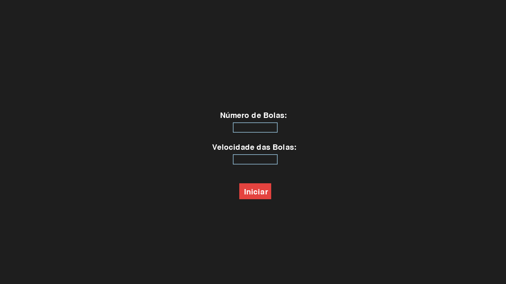
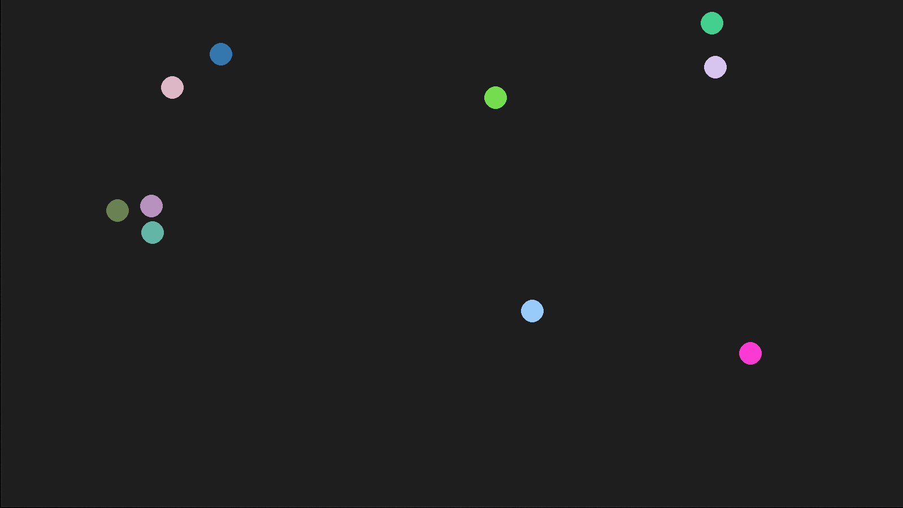

# Simulador de Colisões Elásticas com Pygame


Um simulador simples que demonstra o princípio de colisões perfeitamente elásticas entre partículas em um ambiente 2D, construído com Python e a biblioteca Pygame.





## 📜 Sobre o Projeto

Este projeto foi desenvolvido como um exercício prático para aplicar conceitos de física e matemática em um ambiente de programação. O objetivo é simular o movimento e a interação de múltiplas bolas em um espaço confinado, onde as colisões entre elas e com as paredes seguem as leis da colisão elástica.

## ✨ Funcionalidades

* **Simulação de Física 2D:** As bolas se movem e interagem de acordo com vetores de velocidade.
* **Colisões Elásticas:** Implementação de um modelo de colisão que conserva a energia cinética e o momento linear do sistema.
* **Menu Inicial:** Permite ao usuário definir a quantidade de bolas e a velocidade inicial antes de iniciar a simulação.
* **Detecção de Colisão Precisa:** Detecção de colisão entre as bolas e com as bordas da tela.
* **Efeitos Sonoros:** Feedback audível quando uma colisão ocorre.

## 🛠️ Tecnologias Utilizadas

* [Python](https://www.python.org/)
* [Pygame](https://www.pygame.org/news)

## 🚀 Como Executar

Para executar este projeto localmente, siga os passos abaixo.

**Pré-requisitos:**
* Python 3.x instalado.

**Passos:**

1.  **Clone o repositório:**
    ```bash
    git clone https://github.com/FernandoFrareVieira/simulador-colisoes-elasticas.git
    ```
2.  **Crie um ambiente virtual (recomendado):**
    ```bash
    python -m venv venv
    source venv/bin/activate  # No Windows: venv\Scripts\activate
    ```

3.  **Instale as dependências:**
    O projeto depende apenas da biblioteca Pygame.
    ```bash
    pip install pygame
    ```

4.  **Execute o simulador:**
    ```bash
    python main.py
    ```

## 🧠 A Física por Trás

A resolução das colisões é baseada nas fórmulas para [colisão elástica](https://pt.wikipedia.org/wiki/Colis%C3%A3o_el%C3%A1stica). O núcleo do cálculo envolve:

1.  Encontrar o vetor de distância e o eixo da colisão entre duas partículas.
2.  Projetar a velocidade relativa das partículas sobre o eixo da colisão usando o produto escalar (dot product).
3.  Calcular o impulso a ser trocado, levando em conta as massas das partículas.
4.  Atualizar os vetores de velocidade de cada partícula com base no impulso calculado.

Isso garante que, a cada colisão, tanto a energia quanto o momento do sistema sejam conservados, resultando em um comportamento físico realista.